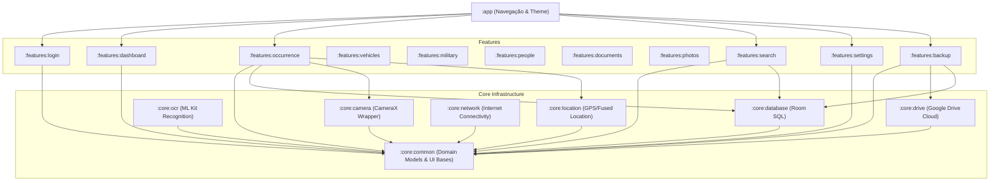

# 🛡️ Arquitetura do Fire Notes

Este projeto segue os princípios de **Clean Architecture**, **MVVM (Model-View-ViewModel)**, **SOLID** e desenvolvimento Android moderno baseado em componentes reativos (Coroutines, Flow, StateFlow).

---

## 📋 Diretrizes Gerais de Engenharia

1.  **Single Source of Truth (SSOT):** O banco de dados Room local representa a única fonte de verdade para a interface do usuário. Toda alteração passa por ele e é observada como um fluxo reativo (`Flow<List<Occurrence>>`).
2.  **Unidirectional Data Flow (UDF):** O fluxo de dados da tela segue o padrão de estados unidirecionais:
    *   **UiState:** O ViewModel expõe um `StateFlow` único contendo o estado imutável da tela.
    *   **UiEvent:** Ações do usuário (clique em botões, digitação) são disparadas para o ViewModel como eventos claros.
3.  **Dependências Baseadas em Abstração:** Nenhuma classe de UI acessa diretamente o banco de dados. Todo acesso é mediado por interfaces de repositórios localizadas no domínio comum (`core:common`).

---

## 🔄 Camadas Arquiteturais de Cada Módulo

Embora o projeto seja fisicamente dividido em módulos Gradle (`core` e `features`), internamente cada módulo de feature segue o padrão lógico de 3 camadas:

```
┌─────────────────────────────────────────────────────────┐
│                       Camada UI                         │
│   (Compose Views, ViewModels, UI State & UI Events)    │
└────────────────────────────┬────────────────────────────┘
                             │ depende de
                             ▼
┌─────────────────────────────────────────────────────────┐
│                     Camada Domain                       │
│       (Use Cases / Interactors, Domain Models,          │
│            Interfaces de Repositórios)                  │
└────────────────────────────▲────────────────────────────┘
                             │ implementa (Dependency Inversion)
                             │
┌─────────────────────────────────────────────────────────┐
│                      Camada Data                        │
│   (Room Entities, DAOs, Google Drive API, Data Sources, │
│            Implementações dos Repositórios)             │
└─────────────────────────────────────────────────────────┘
```

*   **Domain:** Contém as regras de negócio puras em Kotlin. Não depende de bibliotecas Android (Room, Compose, etc.). Define o modelo de dados de domínio e as interfaces que o sistema deve cumprir.
*   **Data:** Responsável pela persistência local (Room) ou remota (Drive API). Implementa as interfaces do domínio e converte dados de infraestrutura em modelos puros de negócio.
*   **UI (Presentation):** Componentes declarativos do Jetpack Compose que renderizam os estados da tela e capturam eventos de usuário, delegando-os para os ViewModels correspondentes.

---

## 🔗 Diagrama de Dependências entre Módulos

O diagrama abaixo mostra como os diferentes módulos do Gradle se relacionam:



---

## 🏆 Padrões de Qualidade Adotados

*   **S.O.L.I.D.:**
    *   *Single Responsibility:* Módulos separados com DAOs e repositórios granulares.
    *   *Dependency Inversion:* Os módulos de UI e Use Cases interagem apenas com interfaces (e.g., `OccurrenceRepository`), cuja injeção é resolvida em tempo de compilação pelo Hilt.
*   **K.I.S.S. (Keep It Simple, Stupid):** Evitar complexidades desnecessárias no gerenciamento de estado.
*   **Y.A.G.N.I. (You Aren't Gonna Need It):** Codificar estritamente o que foi solicitado pelas especificações do Corpo de Bombeiros.
