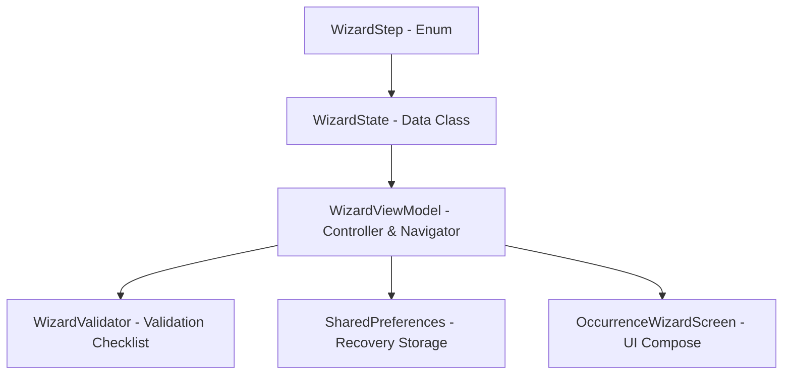

# Arquitetura do Wizard Operacional - Fire Notes V5

A arquitetura do Modo Assistido foi projetada de forma totalmente desacoplada e isolada das telas e fluxos existentes do aplicativo para garantir a manutenibilidade e modularidade do sistema.

## Componentes Criados

1. **WizardStep**: Um enum (`WizardStep`) que mapeia as 9 etapas ordenadas com números e títulos.
2. **WizardState**: Uma data class que encapsula todo o estado transacional do formulário em andamento, incluindo listas de viaturas cadastradas, fila de OCRs pendentes, resultados analisados e coordenadas GPS.
3. **WizardViewModel**: Atua como o **WizardController** e **WizardNavigator** coordenando a transição de telas, injeções de serviços, execução assíncrona do OCR em lote e persistência automática de rascunhos.
4. **WizardValidator**: Classifica os itens de checklist obrigatórios para submissão segura.
5. **Recovery Storage**: Mecanismo de backup local em `SharedPreferences` que reconstrói o estado transacional caso a aplicação sofra fechamento repentino em campo.
6. **OccurrenceWizardScreen**: Camada de visualização no padrão Jetpack Compose projetada com alto contraste para visibilidade sob luz solar intensa ou operação noturna.
