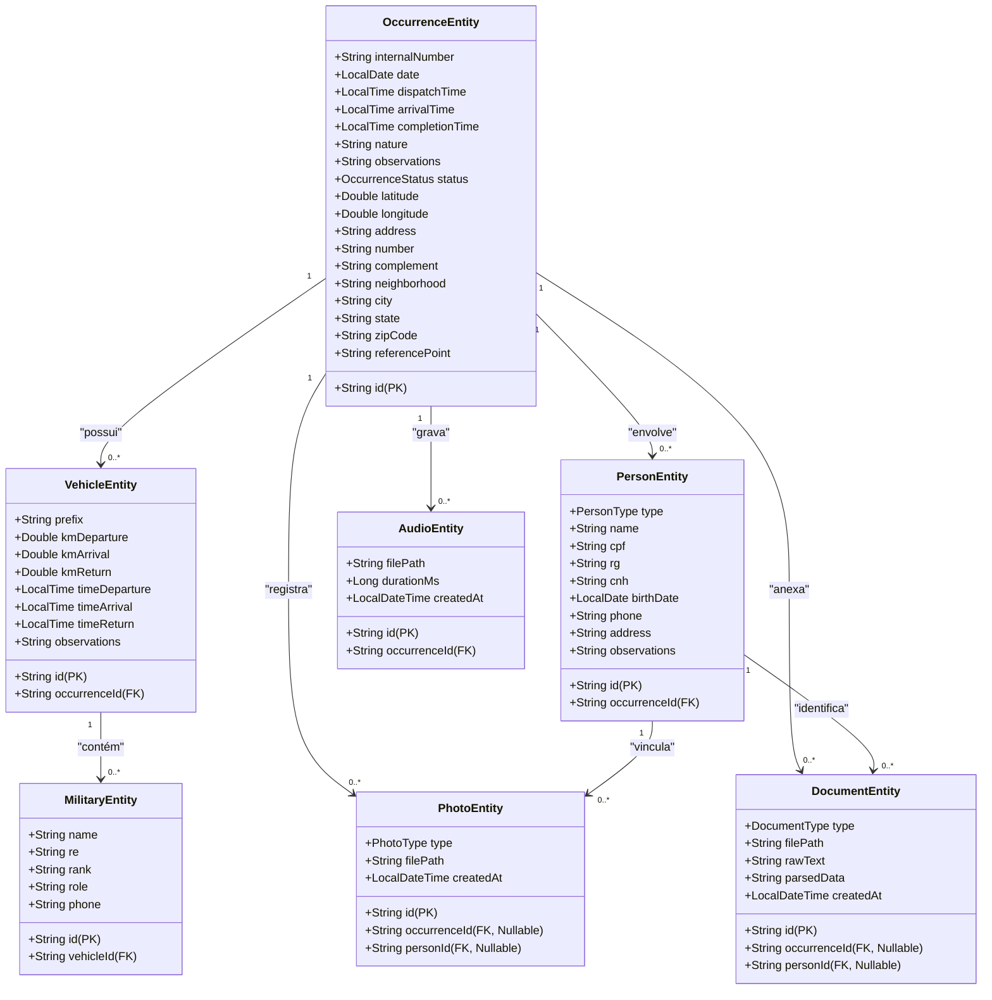

# 🗂️ Modelo de Banco de Dados (Room SQLite)

O aplicativo **Fire Notes** é projetado para operar em ambientes sem internet (offline-first). Por isso, toda a infraestrutura do banco de dados local utiliza o **Room** para persistir as informações geradas em campo.

---

## 🛡️ Decisões de Modelagem

1.  **UUIDs como Chave Primária:** Para evitar conflitos de IDs numéricos autoincrementais locais quando várias viaturas em campo sincronizarem com a nuvem centralizada posteriormente, todas as entidades usam **UUIDs (Strings)** gerados localmente no momento da criação do registro.
2.  **Integridade Referencial (Deleção em Cascata):** As tabelas filhas (como `vehicles`, `people`, `photos`, `documents`, `audios`) estão ligadas à tabela principal `occurrences` (ou à tabela `people`) através de chaves estrangeiras (`ForeignKeys`) do SQLite configuradas com `onDelete = ForeignKey.CASCADE`. Se uma ocorrência for excluída, todas as suas mídias e dependências são removidas automaticamente da base local.
3.  **Indexação e Performance:** Todas as chaves estrangeiras são indexadas (`indices`) no SQLite para prevenir gargalos de performance e travamento da UI durante a leitura rápida dos grafos de objetos da ocorrência.

---

## 📐 Diagrama de Classes do Banco de Dados

O diagrama abaixo ilustra as entidades e seus relacionamentos (1 para N):

---

## 🗂️ Mapeamento Detalhado de Tabelas

### 1. `occurrences`
*   Armazena os metadados principais da ocorrência operacional.
*   **Índices:** Indexada primariamente pelo ID. Consultas comuns de listagem ordenam por `date` e `dispatchTime` de forma descendente.

### 2. `vehicles`
*   Registra os horários e quilometragens das viaturas do Corpo de Bombeiros em atendimento.
*   **Chave Estrangeira:** `occurrenceId` referenciando `occurrences.id` (`onDelete = CASCADE`).

### 3. `military`
*   Mapeia a guarnição (militares) escalada em cada viatura específica para a ocorrência.
*   **Chave Estrangeira:** `vehicleId` referenciando `vehicles.id` (`onDelete = CASCADE`).

### 4. `people`
*   Dados de qualificação de vítimas, condutores de veículos civis ou testemunhas envolvidas.
*   **Chave Estrangeira:** `occurrenceId` referenciando `occurrences.id` (`onDelete = CASCADE`).

### 5. `photos`
*   Caminhos de arquivos locais de fotos capturadas em campo (cenário, viaturas, pessoas, documentos).
*   **Chaves Estrangeiras:**
    *   `occurrenceId` referenciando `occurrences.id` (`onDelete = CASCADE`, opcional).
    *   `personId` referenciando `people.id` (`onDelete = CASCADE`, opcional).

### 6. `documents`
*   Metadados de digitalização de CNH, RG, CRLV ou CPF, guardando o texto cru processado pelo ML Kit OCR e os metadados estruturados.
*   **Chaves Estrangeiras:**
    *   `occurrenceId` referenciando `occurrences.id` (`onDelete = CASCADE`, opcional).
    *   `personId` referenciando `people.id` (`onDelete = CASCADE`, opcional).

### 7. `audios`
*   Áudios com relatos orais gravados por bombeiros militares em campo.
*   **Chave Estrangeira:** `occurrenceId` referenciando `occurrences.id` (`onDelete = CASCADE`).
