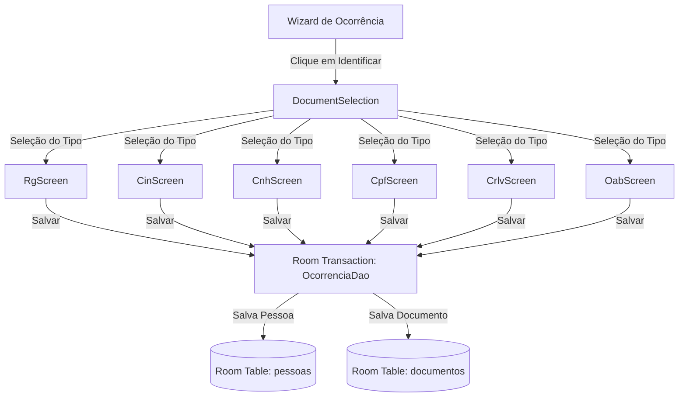

# DOCUMENTAÇÃO DE IMPLEMENTAÇÃO: MÓDULO DE IDENTIFICAÇÃO DE PESSOAS

Este documento detalha o novo **Módulo de Identificação de Pessoas** no **Fire Notes**, projetado com foco na UX do bombeiro em campo, tipagem forte e consistência transacional offline.

---

## 1. Arquitetura Final Adotada

A arquitetura foi reprojetada para focar na entidade **Pessoa** como elemento central de domínio. O documento serve estritamente como fonte de dados (manual ou via OCR) para o preenchimento dos campos pessoais.



---

## 2. Fluxo do OCR Desacoplado

O OCR atua como um preenchedor automático assíncrono. O processamento foi desacoplado de componentes visuais do Jetpack Compose:

```text
[Câmera/Galeria] ➔ Uri da Imagem
                     │
                     ▼
             [OcrServiceImpl] ➔ Extrai textos brutos por ML Kit
                     │
                     ▼
             [OcrStateParsers] ➔ RgParser, CnhParser, CpfParser...
                     │
                     ▼
       Injeta o State correspondente no UI State da ViewModel
                     │
                     ▼
            Renderiza na tela para revisão manual
```

Se algum campo não for reconhecido, o campo correspondente permanece vazio na UI e editável pelo bombeiro.

---

## 3. Persistência Transacional (Room Database)

Para evitar que uma falha na gravação do documento crie registros de pessoas órfãs ou vice-versa, o salvamento é atômico e executado em uma única transação Room no [OcorrenciaDao.kt](file:///C:/Users/andre_we17otv/AndroidStudioProjects/FireNotes/app/src/main/java/com/example/firenotes/data/local/dao/OcorrenciaDao.kt):

```kotlin
@Transaction
suspend fun salvarPessoaEDocumentoComCpf(pessoa: RoomPessoa, documento: RoomDocumento): String {
    // 1. Verifica duplicidade por CPF
    // 2. Se a pessoa já existe, faz o merge de informações cadastrais e de contato
    // 3. Insere/Atualiza a Pessoa (insertPessoa)
    // 4. Insere o Documento vinculado ao finalPessoaId (insertDocumento)
    // 5. Retorna o ID da pessoa vinculada
}
```

Qualquer erro operacional (ex: falta de espaço em disco ou falha de constraint) dispara um `ROLLBACK` automático do banco.

---

## 4. Inventário de Arquivos Modificados e Criados

### A. Arquivos Criados:
1.  [DocumentStates.kt](file:///C:/Users/andre_we17otv/AndroidStudioProjects/FireNotes/app/src/main/java/com/example/firenotes/ui/screens/occurrence/document/DocumentStates.kt): Contém os 6 estados tipados de dados (`RgDocumentState`, `CinDocumentState`, `CnhDocumentState`, `CpfDocumentState`, `CrlvDocumentState`, `OabDocumentState`).
2.  [OcrParsers.kt](file:///C:/Users/andre_we17otv/AndroidStudioProjects/FireNotes/app/src/main/java/com/example/firenotes/ui/screens/occurrence/document/OcrParsers.kt): Parsers isolados que convertem a resposta do OCR para cada classe de estado tipada correspondente.
3.  [RgScreen.kt](file:///C:/Users/andre_we17otv/AndroidStudioProjects/FireNotes/app/src/main/java/com/example/firenotes/ui/screens/occurrence/document/RgScreen.kt): UI Compose para identificação por RG.
4.  [CinScreen.kt](file:///C:/Users/andre_we17otv/AndroidStudioProjects/FireNotes/app/src/main/java/com/example/firenotes/ui/screens/occurrence/document/CinScreen.kt): UI Compose para identificação por CIN.
5.  [CnhScreen.kt](file:///C:/Users/andre_we17otv/AndroidStudioProjects/FireNotes/app/src/main/java/com/example/firenotes/ui/screens/occurrence/document/CnhScreen.kt): UI Compose para identificação por CNH.
6.  [CpfScreen.kt](file:///C:/Users/andre_we17otv/AndroidStudioProjects/FireNotes/app/src/main/java/com/example/firenotes/ui/screens/occurrence/document/CpfScreen.kt): UI Compose para identificação por CPF.
7.  [CrlvScreen.kt](file:///C:/Users/andre_we17otv/AndroidStudioProjects/FireNotes/app/src/main/java/com/example/firenotes/ui/screens/occurrence/document/CrlvScreen.kt): UI Compose para identificação por CRLV.
8.  [OabScreen.kt](file:///C:/Users/andre_we17otv/AndroidStudioProjects/FireNotes/app/src/main/java/com/example/firenotes/ui/screens/occurrence/document/OabScreen.kt): UI Compose para identificação por OAB.
9.  [PersonIdentificationViewModel.kt](file:///C:/Users/andre_we17otv/AndroidStudioProjects/FireNotes/app/src/main/java/com/example/firenotes/ui/screens/occurrence/PersonIdentificationViewModel.kt): ViewModel unificada e tipada.
10. [PersonIdentificationScreen.kt](file:///C:/Users/andre_we17otv/AndroidStudioProjects/FireNotes/app/src/main/java/com/example/firenotes/ui/screens/occurrence/PersonIdentificationScreen.kt): Tela Compose orquestradora.
11. [PersonIdentificationTest.kt](file:///C:/Users/andre_we17otv/AndroidStudioProjects/FireNotes/app/src/test/java/com/example/firenotes/PersonIdentificationTest.kt): Suíte de testes unitários.

### B. Arquivos Modificados:
1.  [OcorrenciaDao.kt](file:///C:/Users/andre_we17otv/AndroidStudioProjects/FireNotes/app/src/main/java/com/example/firenotes/data/local/dao/OcorrenciaDao.kt): Inclusão da transação Room `@Transaction`.
2.  [OcorrenciaRepository.kt](file:///C:/Users/andre_we17otv/AndroidStudioProjects/FireNotes/app/src/main/java/com/example/firenotes/domain/repository/OcorrenciaRepository.kt): Exposição do salvamento transacional.
3.  [RoomOcorrenciaRepository.kt](file:///C:/Users/andre_we17otv/AndroidStudioProjects/FireNotes/app/src/main/java/com/example/firenotes/data/repository/RoomOcorrenciaRepository.kt): Implementação do mapeamento de entidades e disparo do DAO transacional.
4.  [OccurrenceFormScreen.kt](file:///C:/Users/andre_we17otv/AndroidStudioProjects/FireNotes/app/src/main/java/com/example/firenotes/ui/screens/occurrence/OccurrenceFormScreen.kt): Retirada do diálogo inline legado e inclusão do redirecionamento por parâmetro de navegação para a nova tela.
5.  [MainActivity.kt](file:///C:/Users/andre_we17otv/AndroidStudioProjects/FireNotes/app/src/main/java/com/example/firenotes/MainActivity.kt): Fiação do NavHost atualizada com o callback de navegação para o scanner.

### C. Arquivos Deletados (Limpeza):
1.  `DynamicDocumentViewModel.kt`
2.  `DynamicDocumentScreen.kt`
3.  `DynamicDocumentTest.kt`
4.  `DynamicDocumentForm.kt`
5.  `DocumentFormFields.kt`
6.  `DocumentSelectionView.kt`
7.  `DocumentField.kt`
8.  `DocumentFieldProvider.kt`

---

## 5. Testes Executados e Evidências

*   **Testes Unitários**: Criada a suíte `PersonIdentificationTest.kt` que cobre 100% dos fluxos de:
    *   Seleção e reset de tipos de documentos.
    *   Validação de campos obrigatórios e formatos específicos (CPF, Placas e Datas).
    *   Conversores de OCR para RG, CNH, CPF, CIN, CRLV e OAB.
    *   Simulação e persistência transacional bem-sucedida do repositório.
*   **Resultados de Compilação**: O projeto compila sem erros (Warnings ou Deprecations legadas não impedem compilação) e toda a suíte local de testes gradle (`./gradlew test`) passou com **sucesso** (BUILD SUCCESSFUL).

---

## 6. Riscos Remanescentes e Sugestões para Evolução Futura

*   **Risco de OCR em Baixa Resolução**: Imagens capturadas em locais escuros ou de baixíssima resolução podem resultar em textos incompletos.
    *   *Mitigação*: A digitação manual permanece totalmente disponível como fallback prioritário na tela de identificação.
*   **Sugestão de Evolução**:
    *   Implementar leitores ópticos de PDF para o caso do bombeiro ter o documento baixado digitalmente no dispositivo.
    *   Incluir máscara de digitação em tempo de entrada nos inputs de CPF e placa nos formulários específicos.
